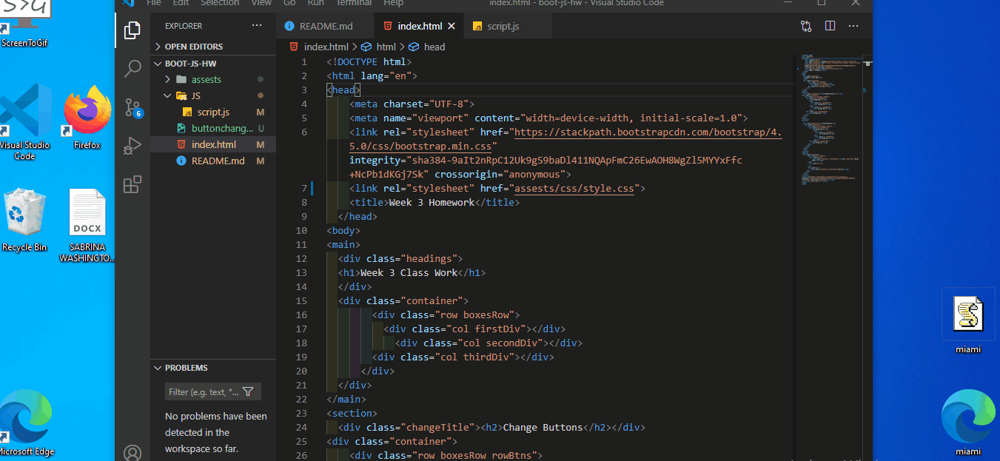

Bootstrap, JavaScript, and jQuery Worksheet
This assignment was assigned for Week three Homework. Students were assigned to create a document in HTML, CSS and the use of Javascript and corresponding links. 
Our first task with this assignment was to create Change box buttons. First, the change box buttons should change the color and border of corresponding box. Next, the Hide box buttons should hide the corresponding box. Then the 
Reset buttons should change the colors back to the default. Lastly, the 
show all buttons should show all boxes. 

